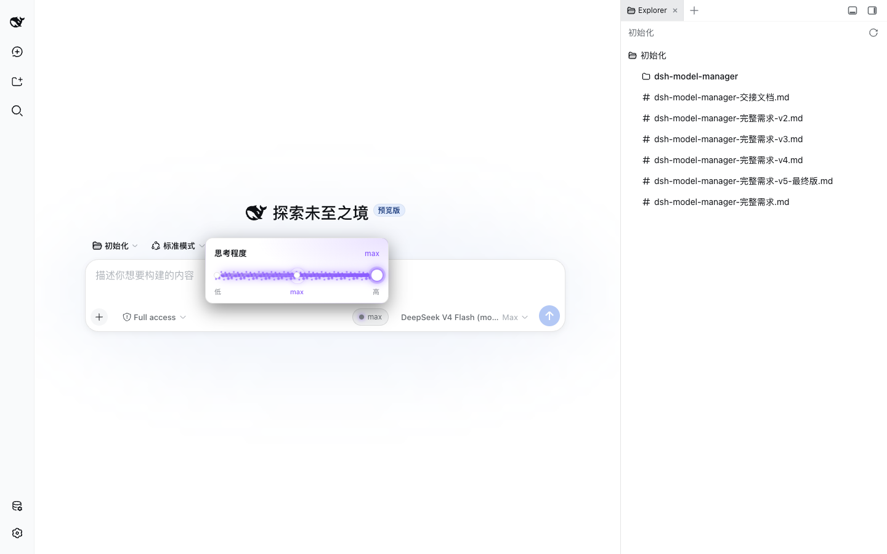
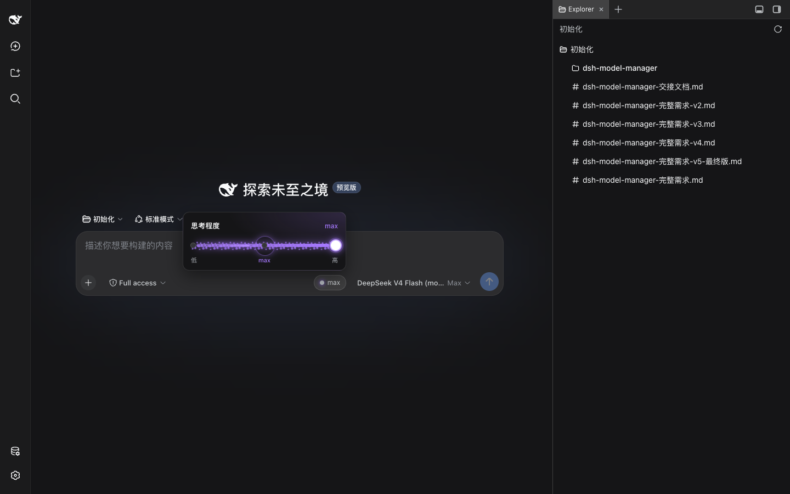
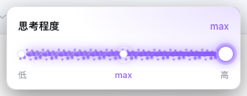
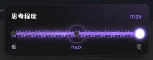
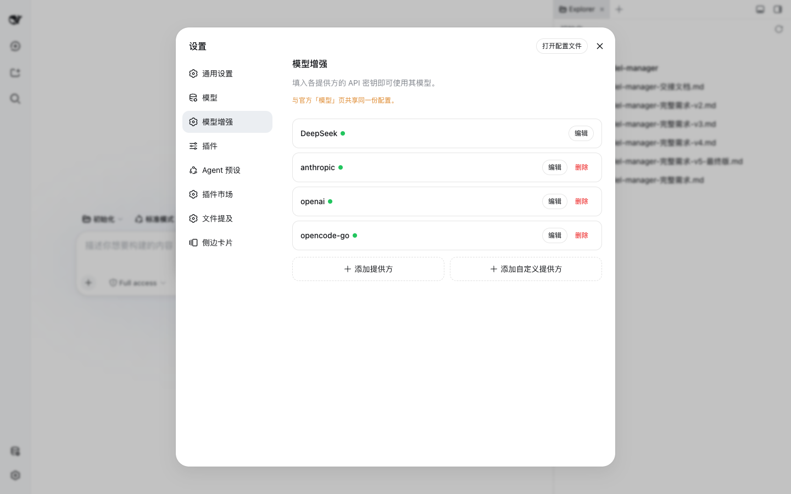

# dsh-model-manager

[中文](README.md) | English

**Model management for DSH, enhanced.** Adds a **「模型增强 (Models Enhanced)」** settings page that fully replicates the official Models page and layers on: same-family multi-gateway providers, per-model thinking-level (reasoning effort) configuration with auto-detection and name-based inference, a Claude/Codex-style **thinking-level slider** in the composer (purple particle fill + white thumb + per-level animations + crisp electronic blips + light/dark adaptive + opens above by default), and per-model visibility control.

The enhanced page **shares the same configuration source** as the official Models page — one `llm-pi-ai` / `llm-deepseek` document, one set of credentials — so the two pages always read and write the same thing and stay in sync. The enhanced page is a strict superset of the official one: anything you can do there, you can do here, plus the extras below.

## Install

Edit your web profile's `package.json` and install from this repository (like every other plugin in the family):

```json
{
  "dependencies": {
    "dsh-model-manager": "github:zmjza/dsh-model-manager"
  }
}
```

```sh
cd ~/.dsh/profiles/web
pnpm update dsh-model-manager   # pulls the latest commit and builds it
```

then restart `dsh web`. The bundle patch (`cordis.patch.yml`) mounts the plugin automatically — no profile file edits.

Or use the CLI channel once published:

```sh
dsh plugin --profile web add dsh-model-manager
```

## What you get

A new **模型增强** entry in Settings, right next to the official Models page:

```
设置 (Settings)
├── 模型            (official page — unchanged)
└── 模型增强         (this plugin — full copy + enhancements)
    ├── provider rows (list / add / edit / delete)
    ├── 添加提供方     → same-family multi-gateway
    ├── 添加自定义提供方
    └── per model: capacities + thinking levels + detect + show/hide
```

| # | Feature | Where |
|---|---|---|
| 1 | Same-family multi-gateway providers | 添加提供方 picker |
| 2 | Per-model thinking levels + default level | model row disclosure + provider editor |
| 3 | Auto-detect by `llm.models` + name-based inference | 思考程度 Detect + auto-fill |
| 4 | Composer thinking-level slider (Claude/Codex style, v5 enhanced) | tool row, beside the model select |
| 5 | Per-model show/hide | model row disclosure |

## 1. Same-family multi-gateway providers

The「添加提供方」picker no longer hides a family once it is configured. Every configurable family stays selectable; choosing one that is already configured creates a **same-family instance** under an incremental route (`openai-2`, `openai-3`, …) with its own relay endpoint, credentials, and model catalog.

- **First-time add** of a family → the official editor (route = family id, key + optional extras).
- **Re-add** of a configured family → a clone card prefilled with the next free route and a hint to enter a distinct relay endpoint.

```
添加提供方 ▾
  openai · instances: 1   ← still selectable
  anthropic · instances: 3
  deepseek · instances: 0
→ creates openai-2, openai-3, …
```

Why this matters: you can point several OpenAI/Anthropic-compatible gateways into one harness — one base URL per instance, one credential per instance, independent model catalogs.

## 2. Per-model thinking levels (思考程度)

Each model row's disclosure adds a **Thinking levels** multi-select. Selecting levels writes the model's `reasoningEfforts` (wire spelling = the level id, the OpenAI-compatible convention), and the composer's model picker then shows exactly the levels you declared.

The pi-ai provider editor adds a **Default thinking level** select writing the route-level `reasoning` default — the level a request falls back to when the UI names none.

| off | minimal | low | medium | high | xhigh | max |
|---|---|---|---|---|---|---|

- A model with no selection keeps its inherited capability (or none), preserving the official behavior exactly.
- Gateways using a different wire spelling can be edited directly in `settings.yaml`.

## 3. Auto-detect + name-based inference

Two sources fill a model's thinking levels:

1. **Detect (llm.models)** — reads the *registered route's* advertised efforts and prefills the selection. Best for official catalog models.
2. **Name-based inference (fallback)** — when the route is not registered or advertises nothing, a built-in rules table infers the family's levels from the model id/name and **auto-fills as soon as you type the id** (while nothing is selected).

The rules follow the official-vendor verification of 2026-08-18 (see the verification table below) — **anything undocumented is left empty rather than guessed**:

| Model id / name | Inferred levels |
|---|---|
| `gpt-5.5`, `gpt-5.6`, `gpt5X` | low / medium / high / xhigh / max |
| `o1`, `o3`, `o4` (o-series) | minimal / medium / high |
| `claude-fable`, `claude-mythos`, `claude-opus-5`, `claude-sonnet-5`, `claude-opus-4.6+`, `claude-sonnet-4.6+` | low / medium / high / xhigh / max |
| `deepseek-v4` (flash / pro) | low / high / max |
| anything else (Gemini / Grok / Qwen / QwQ / Llama / legacy Claude) | (left empty — manual selection, no ladder published) |

The inference table lives in [`src/client/model-efforts.ts`](src/client/model-efforts.ts) — extend it for new families.

## 4. Composer thinking-level slider (v5: particles + per-level animation + sound + theme + opens above)

A capsule + popup **slider** in the composer tool row (Claude / Codex "Effort" style, endpoint copy decision A):

```
  思考程度          (popup card title)
 [high]           (current level — subtitle)
 low ── ●──────○─── high   (purple particle fill + white rounded thumb)
 off  minimal  low  medium  high  xhigh  max
```

- **Look** — a horizontal track with a **purple pixelated-particle fill** running left→right up to the current level, and a **white rounded thumb** (still white / high-contrast in light mode).
- **Endpoint copy (decision A)** — the card title is「**思考程度**」and the endpoints read「**低 ── 高**」(low left, high right).
- **Theme adaptive** — the card surface/borders/text use the theme tokens this DSH build actually provides (`--dsw-alias-bg-base`, `--dsw-alias-border-l2/3`, `--dsw-alias-label-*`, verified on a live render), so the card follows the page theme automatically. The purple particles use a curated `--effort-purple` (light `#8b5cff` / dark `#a678ff`, switched via the `data-ds-dark-theme` attr) because this build exposes no purple accent token.
- **Per-level animation (R4)** — each level drives a different animation morphology (via `data-tier`): `off` = no particles / `minimal` = sparse static specks / `low` = sparse twinkle / `medium` = medium density + drift / `high` = dense + breathing ring / `xhigh` = brighter + growing halo / `max` = full-track shine + comet streak.
- **Crisp electronic sound (recommended)** — switching levels plays a **crisp electronic blip synthesized with Web Audio, pitch ascending with the level** (pentatonic; `off` lowest → `max` brightest, like a volume knob click), no external assets. `AudioContext` is created on the **first user gesture** (autoplay policy), a system mute can cut it, and restricted environments degrade to silent + a console hint.
- **Placement (R5)** — the popup opens **above** the button by default (`bottom: calc(100% + 8px)`), flipping below only when space is tight.
- Reads and writes the **same per-session ModelDirectory** as the official effort panel — the two always agree. Hidden when the current model advertises no reasoning levels; collapsible (a small badge + current-level label when closed).

### Stardust approach (R6: open-source survey → self-written)

Searched directions: `claude stardust` / `sparkle slider` / `reasoning effort slider` / `cosmic particle`. Verdict: **no turn-key, permissively-licensed slider that satisfies all constraints** (theme adaptive + per-level animation + opens above + sound + theme tokens). Claude Code's own effort slider is closed-source; `basmilius/sparkle` and similar are generic canvas FX libraries (heavy, lots of glue); the rest are scattered UI experiments. So we **self-wrote a CSS radial-gradient particle layer**: lightest, most controllable, and native to DSH's theme tokens and CSS Modules — while still meeting every constraint.

## 5. Per-model visibility control

Each model row has a **Show in picker** switch. Toggling it persists to `localStorage` (`dsh.modelManager.visibility`) and new models show by default (opt-out model).

> **Why localStorage and not a settings namespace?** The official settings proxy only exposes model-provider namespaces plus a hard-coded allowlist to configuration clients; a third-party namespace is refused with `settings namespace "…" is not exposed to configuration clients`. Visibility is a UI preference, so browser-local storage is the right home — no host-side registration needed.

## Official verification table (R2 — 2026-08-18)

Per the v5 requirement, every family was checked against the official vendor docs; **models the docs don't spell out are left empty** (conservative):

| Family / model | Official source | Real supported levels | Verdict |
|---|---|---|---|
| OpenAI GPT-5.x (gpt-5.5 / 5.6…) | [Reasoning models guide](https://developers.openai.com/api/docs/guides/reasoning) | low / medium / high / xhigh / max (none/minimal also possible per-model) | ✅ Confirmed (none/minimal conservatively dropped) |
| OpenAI o-series (o1/o3/o4) | same | minimal / medium / high | ✅ Confirmed |
| Anthropic Claude (Fable 5 / Mythos 5 / Opus 5 / Sonnet 5 / Opus 4.6+ / Sonnet 4.6+) | [Effort docs](https://platform.claude.com/docs/en/build-with-claude/effort) | low / medium / high / xhigh / max | ✅ Confirmed (**correction: no "minimal" in the official effort ladder** — 6→5 levels vs v5) |
| DeepSeek V4 (flash / pro) | [Thinking Mode guide](https://api-docs.deepseek.com/guides/thinking_mode) | low / high / max (medium & xhigh map to high) | ✅ Confirmed (**correction: official includes low** — 2→3 levels vs v5) |
| Google Gemini (3 / 2.5) | [Gemini thinking docs](https://ai.google.dev/gemini-api/docs/thinking) | no ladder (budget / thinkingConfig driven) | ⬜ Left empty |
| xAI Grok (grok-4.6…) | [xAI Models](https://docs.x.ai/docs/models) | model card only says "configurable reasoning", no enum | ⬜ Left empty |
| Qwen / QwQ | Qwen docs | no ladder on the OpenAI-compatible surface | ⬜ Left empty |
| Llama (4…) | Llama docs | no ladder on the OpenAI-compatible surface | ⬜ Left empty |

## Configuration source

| Data | Where |
|---|---|
| Providers (incl. multi-instance), model catalogs, `reasoningEfforts`, `reasoning` default | `llm-pi-ai` / `llm-deepseek` namespaces (official, shared with the Models page) |
| API keys | `credentials` (official, write-only) |
| Per-model visibility | `localStorage` → `dsh.modelManager.visibility` |

## Screenshots

> All real-machine captures (rendered by the local `dsh web`; the light/dark pair was taken by switching the app's own 外观 preference — the card follows the theme).

**Composer thinking-level slider — open (light / dark)**

| Light | Dark |
|---|---|
|  |  |

**Slider card close-ups (light / dark)**

| Light | Dark |
|---|---|
|  |  |

**Settings → 模型增强 page**



## Development

```sh
pnpm install
pnpm typecheck
pnpm build        # tsc types + tsdown host ESM + browser client bundle (__ModuleLoader__)
```

The client bundle is built with the official DSH client-bundle preset (`window.__ModuleLoader__.load`), so per-plugin scripts install cleanly through the module table.

## Known Limitations and Deferred Work

- **Official picker filtering.** The official composer model picker reads the host's `session.models` RPC, which has no injection point for filtering. The show/hide switch persists visibility into `localStorage` (consumable by this plugin's surfaces and later custom pickers), but the *official* picker still lists every model. Filtering the official seat means replacing that slot (a full picker rewrite) — deferred.
- **Detect needs a registered route.** Name inference works for any typed id; the `llm.models` probe only enriches routes the adapter already registers, so a not-yet-saved custom gateway relies on name inference or a hand-picked set.
- **Wire spelling.** A hand-declared pi-ai route's thinking levels use the level id as the wire value (`reasoningEfforts: { high: "high", max: "max" }`). Gateways using a different spelling should be edited in `settings.yaml`; a UI for custom wire values is planned.
- **Sound needs browser audio.** `AudioContext` is created after first interaction; if the DSH Client environment forbids it, the slider silently degrades to silent (never blocks the slider).

## License

MIT — see [LICENSE](LICENSE).
